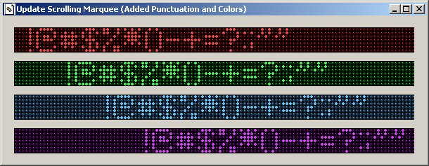



## Active X LED Scrolling Marquee

### Description

ActiveX LED Scrolling Marquee example. I've included the images I used to create this. Very simple project for someone to learn from or compile and use on existing projects. Enjoy and let me know what you think about it.
 
### More Info
 

             |
---                |---
**Submitted On**   |2005-07-17 15:07:30
**By**             |[AJ Trahan](https://github.com/Planet-Source-Code/PSCIndex/blob/master/ByAuthor/aj-trahan.md)
**Level**          |Beginner
**User Rating**    |5.0 (40 globes from 8 users)
**Compatibility**  |VB 6\.0
**Category**       |[Complete Applications](https://github.com/Planet-Source-Code/PSCIndex/blob/master/ByCategory/complete-applications__1-27.md)
**World**          |[Visual Basic](https://github.com/Planet-Source-Code/PSCIndex/blob/master/ByWorld/visual-basic.md)
**Archive File**   |[Active\_X\_L1914407172005\.zip](https://github.com/Planet-Source-Code/aj-trahan-active-x-led-scrolling-marquee__1-61738/archive/master.zip)

